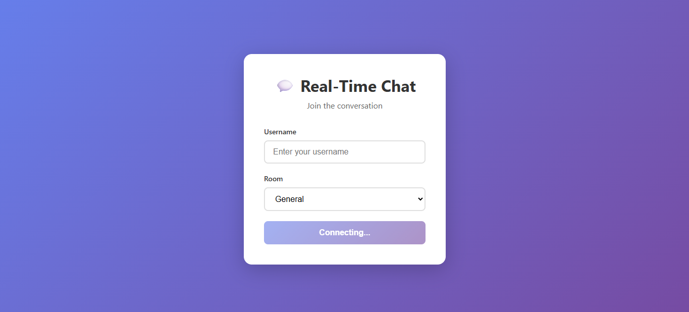
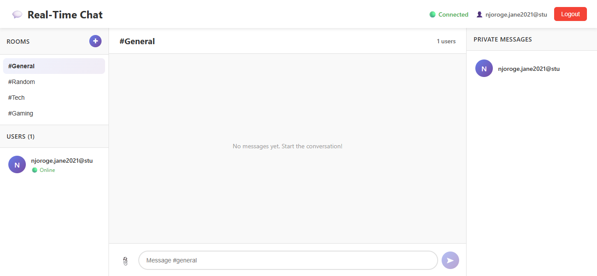
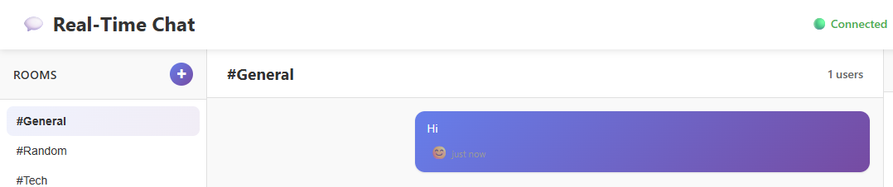

# Real-Time Chat Application with Socket.io

A fully functional real-time chat application built with React, Node.js, Express, and Socket.io. This application demonstrates bidirectional communication between clients and server with advanced features like multiple chat rooms, private messaging, typing indicators, message reactions, read receipts, and real-time notifications.

## 🚀 Features Implemented

### Core Features
- ✅ **Real-time messaging** using Socket.io
- ✅ **User authentication** (username-based)
- ✅ **Multiple chat rooms** (General, Random, Tech, Gaming, and custom rooms)
- ✅ **Private messaging** between users
- ✅ **Online/offline status** for users
- ✅ **Typing indicators** showing when users are typing
- ✅ **Message timestamps** with relative time display

### Advanced Features
- ✅ **Message reactions** (👍, ❤️, 😂, 😮, 😢, 🔥)
- ✅ **Read receipts** showing when messages are read
- ✅ **File and image sharing** (supports images, PDFs, documents)
- ✅ **Message search** functionality
- ✅ **Message pagination** for loading older messages
- ✅ **Unread message counts** per room
- ✅ **Sound notifications** for new messages
- ✅ **Browser notifications** using Web Notifications API
- ✅ **Auto-reconnection** logic for handling disconnections
- ✅ **Responsive design** that works on desktop and mobile devices

## 📁 Project Structure

```
real-time-communication-with-socket-io-J-Njoroge/
├── client/                 # React front-end
│   ├── public/             # Static files
│   ├── src/
│   │   ├── components/     # UI components
│   │   │   ├── ChatRoom.jsx
│   │   │   ├── Message.jsx
│   │   │   ├── MessageList.jsx
│   │   │   ├── MessageInput.jsx
│   │   │   ├── MessageReactions.jsx
│   │   │   ├── UserList.jsx
│   │   │   ├── RoomSelector.jsx
│   │   │   └── PrivateMessage.jsx
│   │   ├── context/        # React context providers
│   │   │   └── SocketContext.jsx
│   │   ├── pages/          # Page components
│   │   │   ├── Login.jsx
│   │   │   └── Chat.jsx
│   │   ├── socket/         # Socket.io client setup
│   │   │   └── socket.js
│   │   ├── App.jsx         # Main application component
│   │   ├── main.jsx        # Entry point
│   │   └── index.css       # Global styles
│   ├── index.html
│   ├── package.json
│   └── vite.config.js
├── server/                 # Node.js back-end
│   ├── server.js           # Main server file
│   ├── package.json        # Server dependencies
│   └── uploads/            # Uploaded files directory (created automatically)
├── README.md
└── Week5-Assignment.md
```

## 🛠️ Setup Instructions

### Prerequisites
- Node.js (v18 or higher)
- npm or yarn
- Modern web browser

### Installation

1. **Clone the repository**
   ```bash
   git clone <repository-url>
   cd real-time-communication-with-socket-io-J-Njoroge
   ```

2. **Install server dependencies**
   ```bash
   cd server
   npm install
   ```

3. **Install client dependencies**
   ```bash
   cd ../client
   npm install
   ```

4. **Configure environment variables** (optional)
   
   Create a `.env` file in the `server` directory:
   ```env
   PORT=5000
   CLIENT_URL=http://localhost:5173
   ```
   
   Create a `.env` file in the `client` directory:
   ```env
   VITE_SOCKET_URL=http://localhost:5000
   ```

5. **Start the development servers**
   
   In the `server` directory:
   ```bash
   npm run dev
   ```
   
   In the `client` directory (new terminal):
   ```bash
   npm run dev
   ```

6. **Open your browser**
   - Navigate to `http://localhost:5173`
   - Enter a username and select a room
   - Start chatting!

## 🎯 Usage Guide

### Getting Started
1. Enter your username (minimum 3 characters)
2. Select a room to join (General, Random, Tech, Gaming, or create a new one)
3. Click "Join Chat" to start chatting

### Features Usage

#### Chat Rooms
- **Switch rooms**: Click on any room in the sidebar to switch
- **Create new room**: Click the "+" button in the Rooms section
- **View unread counts**: Unread message counts appear next to room names

#### Messaging
- **Send messages**: Type in the message input and press Enter or click Send
- **Attach files**: Click the 📎 icon to attach images or files (max 10MB)
- **React to messages**: Click the 😊 icon on any message to add reactions
- **View read receipts**: Messages show when they've been read

#### Private Messaging
- **Start private chat**: Click on any user in the Users list
- **Send private message**: Type and send messages directly to that user
- **View private conversations**: Access via the Private Messages panel

#### Notifications
- **Browser notifications**: Allow notifications when prompted
- **Sound notifications**: Automatically plays for new messages
- **Unread indicators**: See unread counts for rooms and private messages

## 🔧 Technical Details

### Server-Side (Node.js/Express)
- **Socket.io** for real-time bidirectional communication
- **Express** for REST API endpoints
- **Multer** for file upload handling
- **UUID** for unique message IDs
- **CORS** enabled for cross-origin requests

### Client-Side (React)
- **React 18** with functional components and hooks
- **React Router** for navigation
- **Socket.io Client** for real-time communication
- **Vite** as the build tool
- **Context API** for state management

### Socket Events

#### Client → Server
- `user_join`: User joins with username and room
- `join_room`: User switches to a different room
- `send_message`: Send a message to the current room
- `private_message`: Send a private message to a user
- `typing`: Indicate typing status
- `mark_read`: Mark a message as read
- `add_reaction`: Add a reaction to a message
- `remove_reaction`: Remove a reaction from a message
- `search_messages`: Search messages in a room
- `load_messages`: Load older messages (pagination)

#### Server → Client
- `receive_message`: New message received
- `private_message`: Private message received
- `user_list`: Updated list of users in room
- `user_joined`: User joined notification
- `user_left`: User left notification
- `typing_users`: List of users currently typing
- `available_rooms`: List of available rooms
- `room_messages`: Messages for a specific room
- `reaction_added`: Message reaction updated
- `message_read`: Message read receipt
- `search_results`: Message search results
- `paginated_messages`: Paginated message results

## 📱 Responsive Design

The application is fully responsive and works on:
- **Desktop** (1920px and above)
- **Laptop** (1024px - 1920px)
- **Tablet** (768px - 1024px)
- **Mobile** (320px - 768px)

## 🚀 Deployment

### Server Deployment (Render, Railway, Heroku)
1. Set environment variables:
   - `PORT`: Server port (usually provided by platform)
   - `CLIENT_URL`: Your deployed client URL
2. Update client `VITE_SOCKET_URL` to point to deployed server
3. Deploy using platform-specific instructions

### Client Deployment (Vercel, Netlify, GitHub Pages)
1. Build the client:
   ```bash
   cd client
   npm run build
   ```
2. Deploy the `dist` folder
3. Update server `CLIENT_URL` to point to deployed client

## ✅ Assignment Requirements Checklist

### Task 1: Project Setup ✅
- [x] Set up Node.js server with Express
- [x] Configure Socket.io on the server side
- [x] Create React front-end application
- [x] Set up Socket.io client in the React app
- [x] Establish basic connection between client and server

### Task 2: Core Chat Functionality ✅
- [x] Implement user authentication (username-based)
- [x] Create a global chat room where all users can send and receive messages
- [x] Display messages with sender's name and timestamp
- [x] Show typing indicators when a user is composing a message
- [x] Implement online/offline status for users

### Task 3: Advanced Chat Features ✅ (5+ features implemented)
- [x] Create private messaging between users
- [x] Implement multiple chat rooms or channels
- [x] Add "user is typing" indicator
- [x] Enable file or image sharing
- [x] Implement read receipts for messages
- [x] Add message reactions (like, love, etc.)

### Task 4: Real-Time Notifications ✅
- [x] Send notifications when a user receives a new message
- [x] Notify when a user joins or leaves a chat room
- [x] Display unread message count
- [x] Implement sound notifications for new messages
- [x] Add browser notifications (using the Web Notifications API)

### Task 5: Performance and UX Optimization ✅
- [x] Implement message pagination for loading older messages
- [x] Add reconnection logic for handling disconnections
- [x] Optimize Socket.io for performance (using namespaces, rooms)
- [x] Implement message delivery acknowledgment
- [x] Add message search functionality
- [x] Ensure the application works well on both desktop and mobile devices

## 🐛 Known Issues & Future Improvements

- File uploads are stored locally (consider cloud storage for production)
- Messages are stored in memory (consider database integration for persistence)
- No message history persistence across server restarts
- Could add user profiles and avatars
- Could implement message editing and deletion
- Could add emoji picker for better emoji support

## 📚 Resources

- [Socket.io Documentation](https://socket.io/docs/v4/)
- [React Documentation](https://react.dev/)
- [Express.js Documentation](https://expressjs.com/)
- [Building a Chat Application with Socket.io](https://socket.io/get-started/chat)
  
---
## Live Link 
Demo - https://real-time-communication-six.vercel.app/
---

## Screenshots




